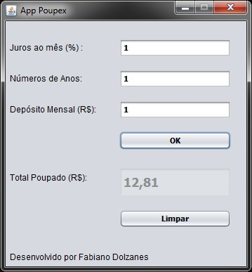

# AppPoupex

App Poupex - Java Swing - NetBeans IDE 8.2

public class Poupanca {
    
    private int anos;
    private double jurosAoMes;
    private double depositoMensal;
    
    public Poupanca(int a, double j, double dm) {
        anos = a;
        jurosAoMes = j/100;
        depositoMensal = dm; 
    }
    
    public double ResultadoTotal() {
        
        int num_pagamentos = anos * 12;
        
        double total = 0;
        for (int i = 0; i < num_pagamentos; i++) {
            total = total + depositoMensal;
            total = total + total * jurosAoMes;
        }
        return total;
    }
    
}
